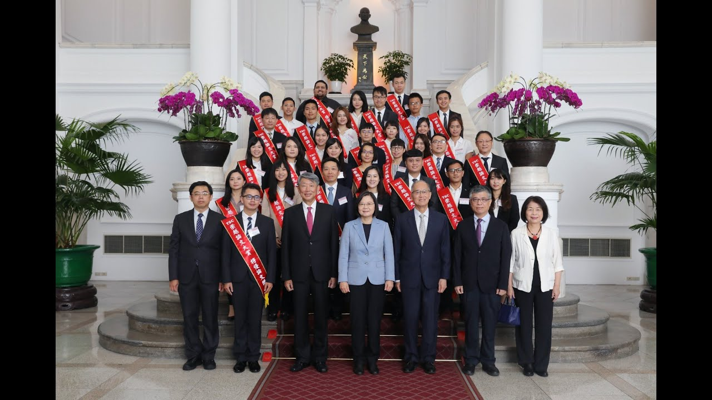

## 😄 Bryan #wu0727
👋 Hi, I'm Bryan!  
📫 I come from Taiwan. 
📚 I hold a master's degree in Information Management at NUU. 
🌱 I wanna be a software engineer or AI engineer.  
Although, I'm a novice, but I love learning new technology and doing the project with team members. 

## 🏆 Awards
**The Thirteenth TCS Thesis Award** - Excellent Paper Award

<!--
**wu0727/wu0727** is a ✨ _special_ ✨ repository because its `README.md` (this file) appears on your GitHub profile.

Here are some ideas to get you started:

- 🔭 I’m currently working on ...
- 🌱 I’m currently learning ...
- 👯 I’m looking to collaborate on ...
- 🤔 I’m looking for help with ...
- 💬 Ask me about ...
- 📫 How to reach me: ...
-  Pronouns: ...
- ⚡ Fun fact: ...
-->
